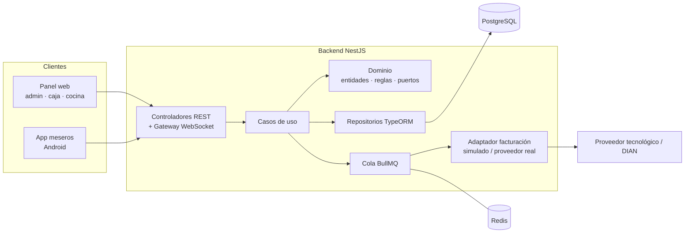
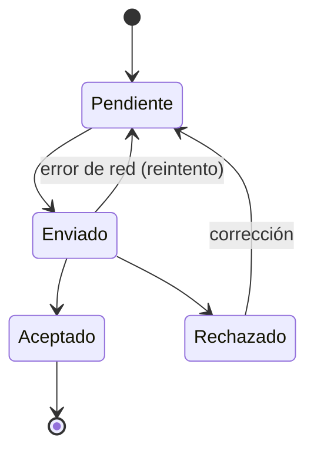

# 🔥 FogónPOS — Sistema para restaurantes con facturación electrónica

Sistema de gestión para restaurantes en Colombia: mesas, pedidos, cocina en tiempo real, caja y **facturación electrónica DIAN** (tiquete POS electrónico y factura electrónica de venta).

> Proyecto de portafolio. La facturación usa un **adaptador simulado** que genera CUFE/CUDE reales (SHA-384) y PDF con QR, y está diseñado para conectarse a un proveedor tecnológico real sin tocar el dominio.

Este repositorio contiene el **backend** y el **panel web** (admin, caja y cocina). La app Android para meseros se documentará en `frontend/projects/meseros/README.md` cuando se construya (Fase 3).

---

## 📋 Tabla de contenido

- [Características](#-características)
- [Stack tecnológico](#-stack-tecnológico)
- [Arquitectura](#-arquitectura)
- [Estructura del repositorio](#-estructura-del-repositorio)
- [Requisitos](#-requisitos)
- [Instalación y ejecución](#-instalación-y-ejecución)
- [Variables de entorno](#-variables-de-entorno)
- [Roles del sistema](#-roles-del-sistema)
- [Facturación electrónica](#-facturación-electrónica)
- [Plan de desarrollo](#-plan-de-desarrollo)
- [Convenciones](#-convenciones)

---

## ✨ Características

- **Catálogo:** categorías, productos, precios, disponibilidad y tipo de impuesto por producto (INC 8%, IVA 19%, excluido).
- **Mesas y pedidos:** mapa de mesas, estados, asignación de mesas por mesero, división y unión de cuentas.
- **Cocina en tiempo real (KDS):** las comandas llegan al instante por WebSockets.
- **Caja:** apertura y cierre de turno, múltiples métodos de pago, propina voluntaria separada de la base gravable y cuadre de caja.
- **Facturación electrónica:** tiquete POS electrónico o factura electrónica según lo que pida el cliente, notas crédito, numeración autorizada con alertas y envío por correo.
- **Robustez:** cola de envíos con reintentos y modo contingencia para que la caja nunca se bloquee.
- **Reportes:** ventas del día, productos más vendidos, impuestos causados e historial de documentos.

> Las características marcadas arriba son el alcance objetivo del proyecto. El estado real de avance por fase está en [Plan de desarrollo](#-plan-de-desarrollo).

---

## 🛠 Stack tecnológico

| Capa | Tecnología |
|---|---|
| Backend | NestJS · TypeScript · Arquitectura Hexagonal |
| Base de datos | PostgreSQL + TypeORM |
| Colas | BullMQ + Redis |
| Tiempo real | WebSockets (Socket.IO) |
| Frontend web | Angular (workspace multi-proyecto) · SCSS |
| App meseros | Angular + Capacitor (Android) — Fase 3 |
| Infraestructura | Docker · Docker Compose |
| Pruebas | Jest (unitarias) · Supertest (e2e) |

---

## 🏛 Arquitectura

El backend sigue **Arquitectura Hexagonal (puertos y adaptadores)**. El dominio no depende de frameworks, base de datos ni del proveedor de facturación.



Cada módulo tiene la misma estructura:

```
src/modules/<modulo>/
├── domain/           # entidades, value objects, puertos (interfaces)
├── application/      # casos de uso
└── infrastructure/   # controladores, repositorios, adaptadores
```

Los módulos no comparten entidades TypeORM entre sí: cada aggregate guarda referencias por `id` (uuid) a otros módulos, y la integridad referencial se garantiza a nivel de base de datos con foreign keys en las migraciones. Esto mantiene el dominio de cada módulo desacoplado del resto.

---

## 📁 Estructura del repositorio

```
fogon-pos/
├── backend/
│   └── src/
│       ├── modules/
│       │   ├── auth/          # Fase 1
│       │   ├── usuarios/
│       │   ├── catalogo/
│       │   ├── mesas/
│       │   ├── pedidos/
│       │   ├── cocina/        # Fase 4
│       │   ├── caja/
│       │   ├── clientes/
│       │   ├── facturacion/
│       │   └── reportes/      # Fase 9
│       └── shared/
│           ├── config/
│           └── database/
├── frontend/
│   └── projects/
│       ├── admin/        # panel web: admin, caja, cocina, reportes
│       ├── meseros/      # app Android (Capacitor) — Fase 3
│       └── shared/       # modelos, servicios HTTP, auth, WebSockets
├── docker-compose.yml
└── README.md
```

---

## ✅ Requisitos

- Node.js 20 o superior
- Docker y Docker Compose
- Angular CLI y Nest CLI

```bash
npm i -g @angular/cli @nestjs/cli
```

---

## 🚀 Instalación y ejecución

```bash
# 1. Clonar el repositorio
git clone <url-del-repositorio>
cd fogon-pos

# 2. Levantar PostgreSQL y Redis
docker compose up -d

# 3. Backend
cd backend
cp .env.example .env
npm install
npm run migration:run
npm run seed
npm run start:dev        # http://localhost:3000/api

# 4. Panel web (en otra terminal)
cd frontend
npm install
npx ng serve admin       # http://localhost:4200
```

Usuarios de prueba creados por el seed:

| Rol | Usuario | Contraseña / PIN |
|---|---|---|
| Admin | admin@fogonpos.dev | `Admin123*` |
| Cajero | caja@fogonpos.dev | `Caja123*` |
| Cocina | cocina@fogonpos.dev | `Cocina123*` |
| Mesero | mesero1 | PIN `1234` |

---

## 🔐 Variables de entorno

El backend lee su configuración de `backend/.env`, que **no se versiona** (está en `.gitignore`). Copia la plantilla y ajusta los valores según tu entorno:

```bash
cd backend
cp .env.example .env
```

| Variable | Descripción |
|---|---|
| `PORT`, `NODE_ENV` | Puerto y entorno del backend |
| `DB_HOST`, `DB_PORT`, `DB_USER`, `DB_PASSWORD`, `DB_NAME` | Conexión a PostgreSQL |
| `REDIS_HOST`, `REDIS_PORT` | Conexión a Redis (colas BullMQ) |
| `JWT_SECRET`, `JWT_EXPIRES_IN` | Firma y expiración de los tokens de sesión |
| `FACTURACION_PROVEEDOR`, `FACTURACION_API_URL`, `FACTURACION_API_KEY` | Adaptador de facturación electrónica activo (`simulado` por defecto) |
| `CORS_ORIGINS` | Orígenes permitidos para el panel web (separados por coma) |

> `DB_PORT` en `.env.example` usa `5434` en lugar del `5432` por defecto, porque `docker-compose.yml` mapea Postgres a ese puerto para evitar choques con otras instancias de PostgreSQL (nativas o de otros proyectos en Docker) en la máquina de desarrollo. Ajusta ambos si tu entorno no tiene ese conflicto.

---

## 👥 Roles del sistema

| Rol | Acceso |
|---|---|
| **Admin** | Catálogo, usuarios, mesas, asignaciones, resoluciones de numeración, reportes |
| **Cajero** | Turnos, cobros, emisión de documentos electrónicos, notas crédito |
| **Cocina** | Pantalla KDS: ver comandas y marcar platos como listos |
| **Mesero** | App Android: sus mesas, pedidos y solicitud de cuenta |

---

## 🧾 Facturación electrónica

### Documentos que maneja

| Documento | Cuándo se emite |
|---|---|
| Tiquete POS electrónico (documento equivalente) | Venta a consumidor final que no pide factura |
| Factura electrónica de venta | El cliente la solicita con cédula o NIT |
| Nota crédito | Anular o corregir un documento ya aceptado |

### Diseño

```
facturacion/
├── domain/
│   ├── entities/documento-electronico.entity.ts
│   ├── entities/resolucion-numeracion.entity.ts
│   └── ports/
│       ├── documento-electronico.repository.port.ts
│       ├── resolucion-numeracion.repository.port.ts
│       └── proveedor-facturacion.port.ts   ← puerto (Fase 6)
├── application/
│   ├── emitir-documento.use-case.ts        (Fase 6)
│   └── emitir-nota-credito.use-case.ts     (Fase 7)
└── infrastructure/
    ├── persistence/                        ← repos TypeORM (Fase 0)
    ├── adapters/
    │   ├── proveedor-simulado.adapter.ts   ← genera CUFE/CUDE + PDF (Fase 6)
    │   └── proveedor-real.adapter.ts       ← API del proveedor (Fase 10)
    └── queue/envio-documentos.processor.ts (Fase 7)
```

El adaptador activo se elige con `FACTURACION_PROVEEDOR`.

### Ciclo de vida de un documento



### Reglas de negocio implementadas

- La propina es voluntaria y **no hace parte de la base gravable**.
- Cada tipo de documento usa un rango autorizado con prefijo; el sistema alerta cuando el rango se agota o la resolución está por vencer.
- Un documento aceptado no se elimina: se corrige con nota crédito.
- Se guardan el JSON enviado, el XML y la respuesta del proveedor para auditoría.

> ⚠️ La normativa tributaria cambia con frecuencia. Las tarifas y reglas de este proyecto son de referencia y deben validarse con un contador antes de un uso real.

---

## 🗺 Plan de desarrollo

- [x] **Fase 0 – Base del proyecto:** monorepo, Docker (PostgreSQL + Redis), TypeORM, estructura hexagonal, modelo de datos inicial.
- [x] **Fase 1 – Autenticación y roles:** JWT, login por PIN para meseros, guards, asignación de mesas por mesero.
- [x] **Fase 2 – Catálogo:** CRUD de categorías y productos con tipo de impuesto.
- [ ] **Fase 3 – App de meseros:** Angular + Capacitor (Android).
- [ ] **Fase 4 – Cocina en tiempo real:** gateway WebSocket, pantalla KDS y notificaciones a meseros.
- [ ] **Fase 5 – Caja y pagos:** turnos, métodos de pago, propina y cuadre de caja.
- [ ] **Fase 6 – Facturación simulada:** puerto, adaptador simulado, CUFE/CUDE, PDF con QR y clientes.
- [ ] **Fase 7 – Robustez de facturación:** cola BullMQ, estados, reintentos, contingencia, notas crédito, numeración y correo.
- [ ] **Fase 8 – Modo sin conexión (app):** sincronización de pedidos pendientes.
- [ ] **Fase 9 – Reportes:** dashboard de ventas, productos e impuestos.
- [ ] **Fase 10 – Integración real (opcional):** adaptador al sandbox de un proveedor tecnológico.
- [ ] **Fase 11 – Pulido:** tests, datos semilla, deploy, capturas y video demo.

---

## 📐 Convenciones

**Ramas:** `main` (estable), `develop` (integración), `feature/<fase>-<descripcion>`.

**Commits** ([Conventional Commits](https://www.conventionalcommits.org/es/)):

```
feat(pedidos): agregar notas por producto
fix(facturacion): corregir cálculo de base gravable con propina
docs: actualizar README con variables de entorno
```

**Scripts del backend:**

| Comando | Descripción |
|---|---|
| `npm run start:dev` | Servidor en modo desarrollo |
| `npm run test` | Pruebas unitarias |
| `npm run test:e2e` | Pruebas end-to-end |
| `npm run migration:generate` | Generar migración |
| `npm run migration:run` | Ejecutar migraciones |
| `npm run seed` | Cargar datos de prueba |

---

## 👤 Autor

**Alejo** — Desarrollador web
